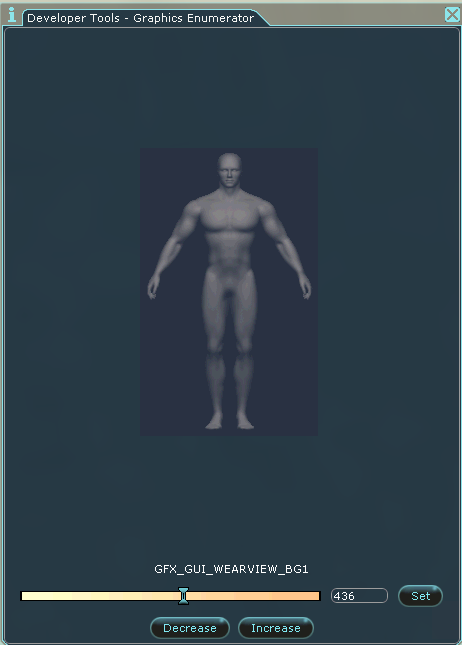
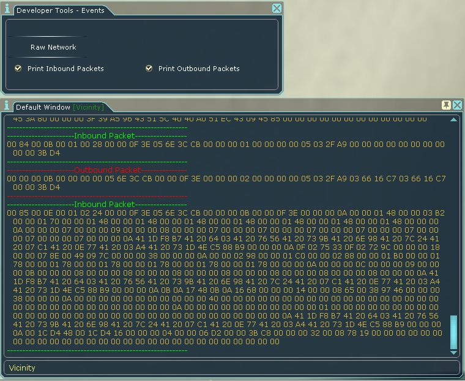

# AOSharp DevTools

A collection of helpful resources for developing AOSharp plugins.

### Screenshots

Main contronl panel.

Enumerate various constants, such as UI graphics.

Run functions from various DLLs.

Toggle event handling on and off. In this example, print inbound and outbound packets to chat.

### Known Issues

* It's currently possible to exceed the max value set on enumerator views. This is caused by not being able to dynamically change the max_value attribute of Slider UI elements. Pretty sure I had this figured out at one point, but then made the mistake of sleeping.

